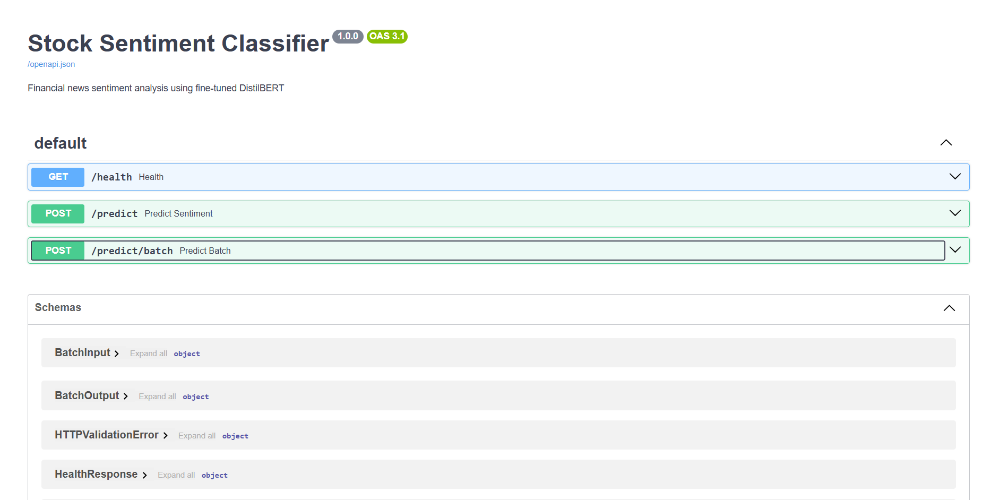

# Stock News Sentiment Classifier

A production-grade NLP pipeline that classifies financial news headlines as **positive**, **neutral**, or **negative** sentiment. Built with a full MLOps lifecycle — from data ingestion to containerized deployment.



---

## MLOps Stack

| Layer | Tool |
|---|---|
| Experiment Tracking | MLflow |
| Model Serving | FastAPI + Uvicorn |
| Containerization | Docker |
| Model Registry | HuggingFace Hub |
| Version Control | Git + GitHub |

---

## Model Performance

| Model | Macro F1 | Negative F1 | Neutral F1 | Positive F1 |
|---|---|---|---|---|
| TF-IDF + Logistic Regression (baseline) | 0.72 | 0.65 | 0.84 | 0.68 |
| DistilBERT (fine-tuned) | **0.86** | **0.88** | **0.90** | **0.78** |

Trained on [Financial PhraseBank](https://huggingface.co/datasets/takala/financial_phrasebank) — 4,836 sentences labeled by finance professionals (after deduplication and conflict removal).

---

## Architecture

```
Raw Data (Financial PhraseBank)
        ↓
Data Pipeline (make_dataset.py → split_data.py)
        ↓
Experiment Tracking (MLflow)
        ↓
  ┌─────────────────────────────┐
  │  Baseline: TF-IDF + LogReg  │  Macro F1: 0.72
  │  Final:    DistilBERT       │  Macro F1: 0.86
  └─────────────────────────────┘
        ↓
Model Registry (HuggingFace Hub)
        ↓
FastAPI (3 endpoints)
        ↓
Docker Container
```

---

## API Endpoints

| Method | Endpoint | Description |
|---|---|---|
| GET | `/health` | Returns model status and version |
| POST | `/predict` | Single headline sentiment prediction |
| POST | `/predict/batch` | Batch prediction for multiple headlines |

### Example Request
```bash
curl -X POST "http://localhost:8000/predict" \
  -H "Content-Type: application/json" \
  -d '{"headline": "Company reports record profits for Q3"}'
```

### Example Response
```json
{
  "headline": "Company reports record profits for Q3",
  "sentiment": "positive",
  "confidence": 0.9282
}
```

---

## Project Structure

```
stock-sentiment-classifier/
├── data/
│   ├── raw/                    # Raw Financial PhraseBank data
│   └── processed/              # Train/val/test splits
├── src/
│   ├── data/
│   │   ├── make_dataset.py     # Data ingestion and parsing
│   │   └── split_data.py       # Stratified train/val/test split
│   ├── models/
│   │   ├── train_baseline.py   # TF-IDF + LogReg baseline
│   │   └── train_distilbert.py # DistilBERT fine-tuning
│   └── api/
│       ├── main.py             # FastAPI app
│       ├── schemas.py          # Pydantic request/response models
│       └── model_loader.py     # Model loading and inference
├── notebooks/
│   └── 01_eda.ipynb            # Exploratory data analysis
├── Dockerfile
├── docker-compose.yml
├── requirements.txt            # Full dev environment
└── requirements-prod.txt       # Production API only
```

---

## Quick Start

### Run with Docker
```bash
docker pull mightyeagle0/stock-sentiment-api:v2
docker run -p 8000:8000 mightyeagle0/stock-sentiment-api:v2
```

### Run locally
```bash
# Clone the repo
git clone https://github.com/AbhishekSahu-GG/Stock-Sentiment-Classifier.git
cd Stock-Sentiment-Classifier

# Create virtual environment
python -m venv venv
venv\Scripts\activate  # Windows

# Install dependencies
pip install -r requirements.txt

# Train the model
python src/models/train_distilbert.py

# Run the API
uvicorn src.api.main:app --reload
```

### Retrain from scratch
```bash
python src/data/make_dataset.py
python src/data/split_data.py
python src/models/train_baseline.py   # Baseline
python src/models/train_distilbert.py # DistilBERT
```

---

## MLflow Experiment Tracking

```bash
mlflow ui --backend-store-uri sqlite:///mlflow.db
```
Open `http://127.0.0.1:5000` to compare experiment runs.

---

## Model

Fine-tuned model hosted on HuggingFace Hub:
**[MightyEagle1/stock-sentiment-distilbert](https://huggingface.co/MightyEagle1/stock-sentiment-distilbert)**

---

## Known Limitations

- Model shows lower confidence on short, ambiguous headlines
- Positive class recall (0.69) is the weakest — subtle positive language in financial text is harder to detect
- Future improvement: export to ONNX Runtime to reduce Docker image size from ~2.5GB to ~500MB

---

## Tech Stack

Python · PyTorch · HuggingFace Transformers · MLflow · FastAPI · Docker · Scikit-learn · Pandas · CI/CD
